# **STM32 Sensor Display – Bare-Metal SPI / I2C / UART / GPIO**

Bare-metal C project using the **STM32F401RE** Nucleo board.
Reads acceleration data from the **ADXL345 (I2C)**, displays results on an **ST7735 TFT screen (SPI)**, and uses **GPIO** for LEDs, buzzer, and pushbutton input.
UART prints orientation state messages to the PC COM port.

---

## 🚀 Features

* ✔ **Bare-metal C (NO HAL / NO LL)**
* ✔ Custom **I2C driver** for ADXL345
* ✔ Custom **SPI driver** for ST7735
* ✔ **UART printf** output to PC
* ✔ BIG text display (scaled font)
* ✔ Full-screen color change based on orientation
* ✔ Raw X/Y/Z values displayed on TFT
* ✔ Pushbutton + blue LED (GPIO input mode)
* ✔ Green/Red orientation LEDs, buzzer (GPIO output mode)

---

## 🧱 Hardware Setup

###  Development Board

**STM32F401RE Nucleo-64**

|                                                  |
| ------------------------------------------------ |
|  |

---

## 🧰 Components Used

| Component                 | Image                                         | Protocol | Pin(s) Used                                           | Description                  |
| ------------------------- | --------------------------------------------- | -------- | ----------------------------------------------------- | ---------------------------- |
| **ST7735 TFT Display**    | 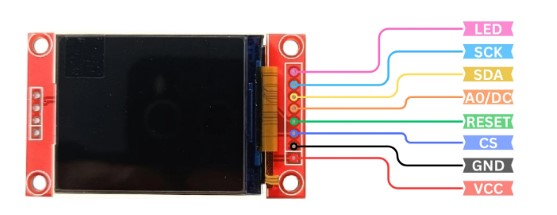     | SPI      | PB3 (CS), PB4 (DC), PB5 (RST), PB10 (SCK), PC3 (MOSI) | 128×160 color LCD            |
| **ADXL345 Accelerometer** | 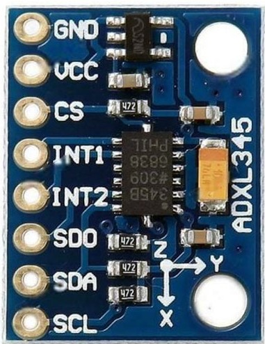    | I2C      | PB8 (SCL), PB9 (SDA)                                  | ±4g orientation sensor       |
| **UART2 Output**          |    | USART2   | PA2 → USB                                             | Sends “NORMAL/FLIPPED” to PC |
| **Pushbutton**            | 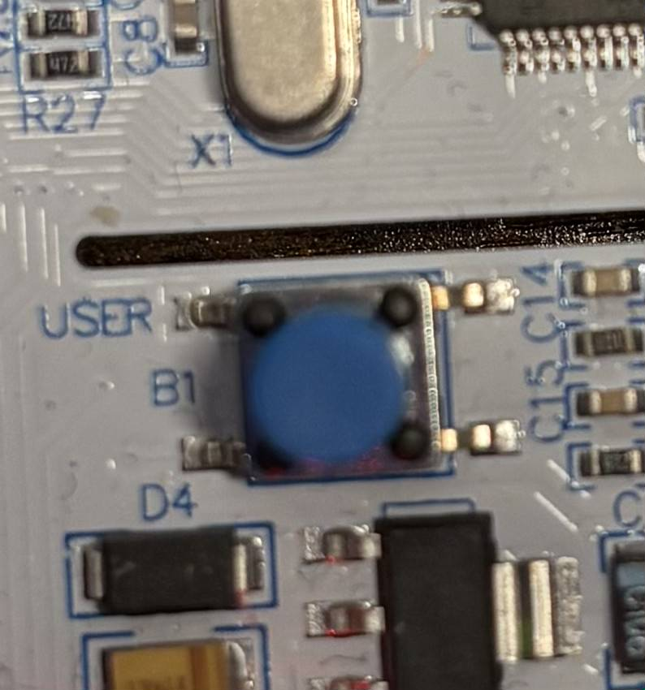 | GPIO Input    | PC13                                                  | Triggers LED toggle (press = LED off, release = LED on)        |
| **External Blue LED**     | 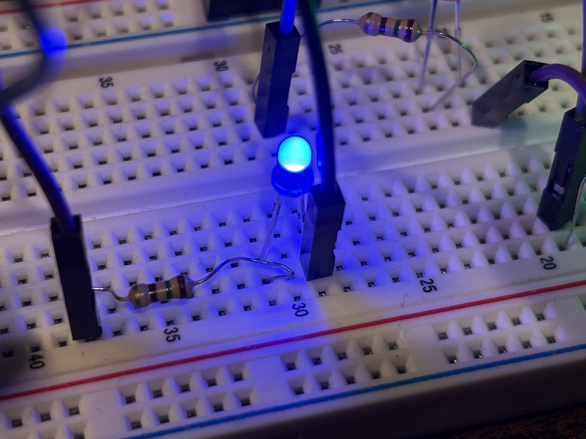 | GPIO  Output   | PA5                                                  | Visual indicator used with pushbutton (ON when button released, OFF when pressed)        |
| **Green LED**             |   | GPIO     | PA8                                                   | ON in NORMAL orientation     |
| **Red LED**               |     | GPIO     | PA9                                                   | ON in FLIPPED orientation    |
| **Buzzer**                | 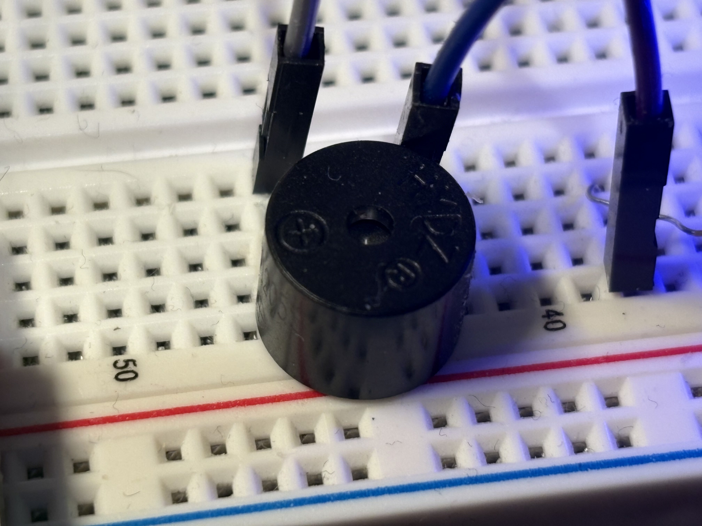     | GPIO     | PA6                                                   | Audible alert when flipped   |

---

## 🔌 Breadboard Setup

| Full Breadboard View                               |
| -------------------------------------------------- |
| 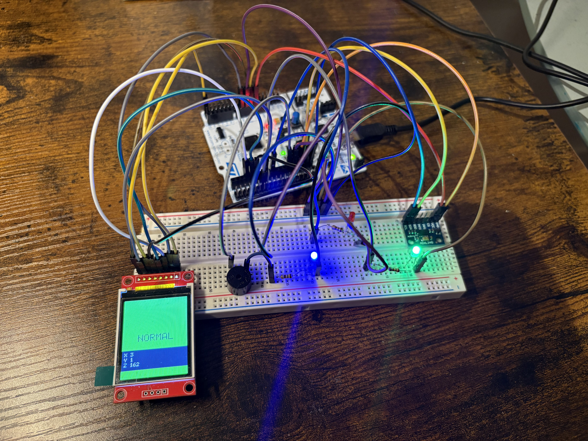 |

## 📡 How It Works

1. ADXL345 sends X/Y/Z values over I2C
2. Z-axis determines orientation:

   * **Z > 0 → NORMAL**
   * **Z < 0 → FLIPPED**
3. LCD background switches GREEN/RED
4. “NORMAL” or “FLIPPED” sent via UART
5. LEDs + buzzer update accordingly
6. Raw XYZ values drawn on the lower TFT area

---

## 🟩 Case (1): Z-axis Positive — Normal Orientation

Device is placed flat on a table with the ADXL345 facing upward.
Z-axis reads a positive value.

### System Behaviour Table

| Component                 | Proof Image                                     | Behaviour Explanation                                                                             |
| ------------------------- | ----------------------------------------------- | ------------------------------------------------------------------------------------------------- |
| **ADXL345 Accelerometer** |       | Sensor is facing upward → Z-axis ≈ **+1g**.                                                       |
| **ST7735 LCD**            | 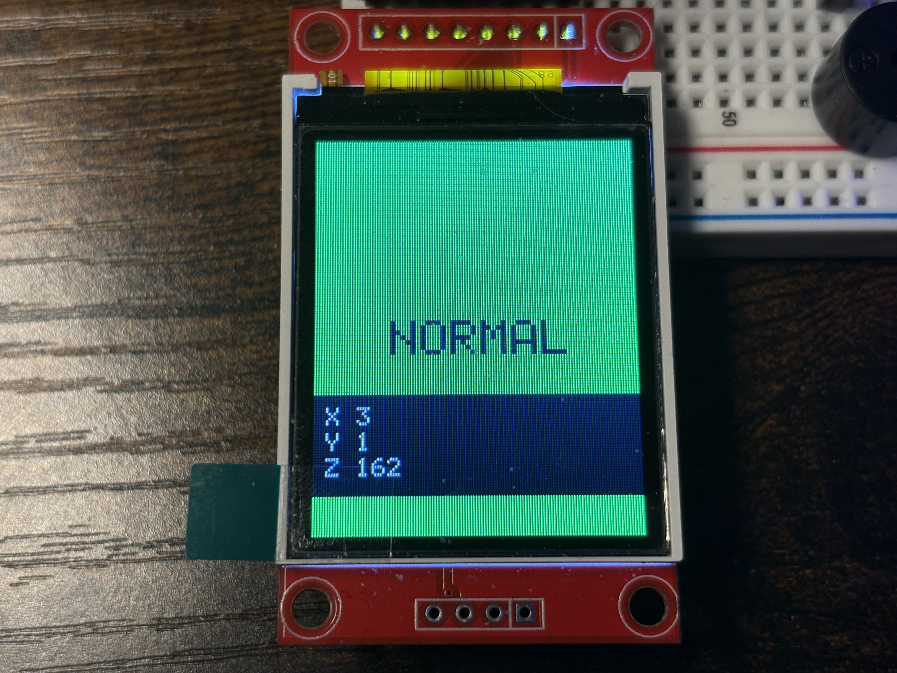   | Screen shows **green wallpaper** and large text **“NORMAL”**. XYZ raw values displayed at bottom. |
| **Green LED (PA8)**       | 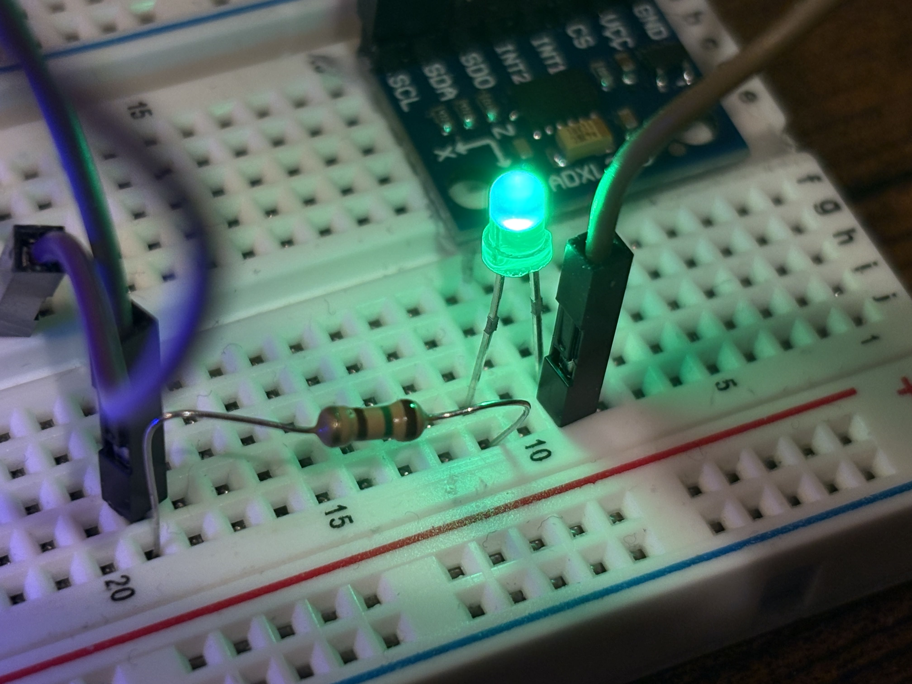 | Green LED **turns ON** to indicate stable “normal” position.                                      |
| **Red LED (PA9)**         | 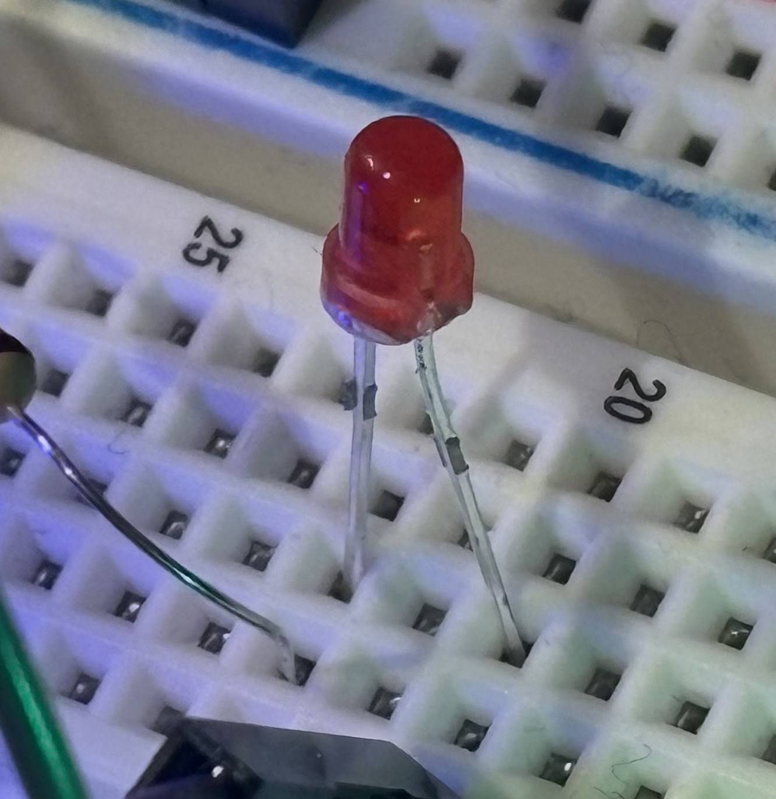  | Red LED **remains OFF** since device is not flipped.                                              |
| **Buzzer**                |    | Buzzer stays **OFF** in normal orientation.                                                       |
| **UART Output**           | 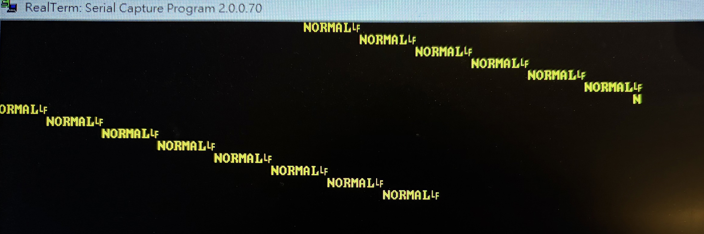  | UART prints **“NORMAL”** to the computer COM port.                                                |

---
## Full Breadboard Setup

Complete hardware setup when the device is in **normal orientation** (Z positive).

---
## 🔻 Case (2): Z axis is Negative — Device is Flipped

Device is flipped with the ADXL345 facing downward.
Z-axis reads a negative value.

#  System Behaviour Table — **Flipped Orientation (Z Negative)**

| Component                 | Proof Image                                      | Behaviour Explanation                                                                                      |
| ------------------------- | ------------------------------------------------ | ---------------------------------------------------------------------------------------------------------- |
| **ADXL345 Accelerometer** | 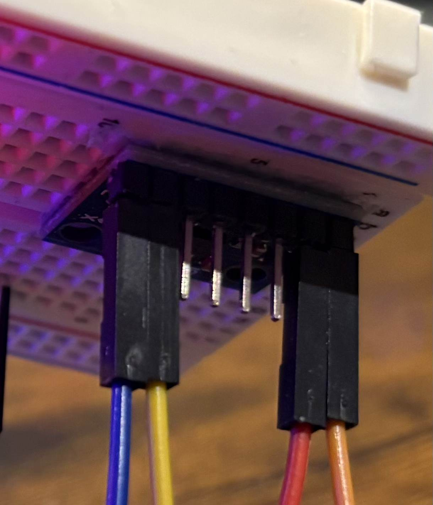     | Sensor is facing **downward** → Z-axis ≈ **−1g** (upside-down).                                            |
| **ST7735 LCD**            | 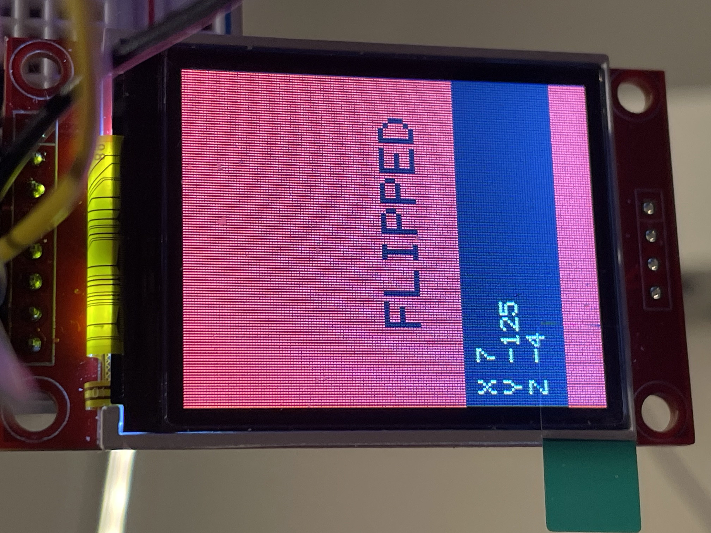   | Screen shows **red wallpaper** and large text **“FLIPPED”**. XYZ raw values still displayed at the bottom. |
| **Green LED (PA8)**       | 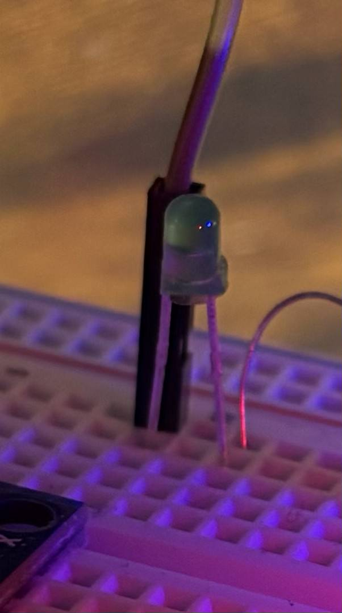 | Green LED **turns OFF**, because device is not in normal position.                                         |
| **Red LED (PA9)**         |     | Red LED **turns ON** to signal a flipped / unsafe orientation.                                             |
| **Buzzer**                |      | Buzzer switches **ON** to alert the user.                                                                  |
| **UART Output**           |   | UART continuously prints **“FLIPPED”** to the computer COM port.                                           |

---
## Full Breadboard Setup

Complete hardware setup when the device is in **flipped orientation** (Z negative ).

---

# 🔵 Case 3 — User Pushes the On-Board Button (GPIO Input)

| Component              | Proof Image                                            | Behaviour Explanation                          |
| ---------------------- | ------------------------------------------------------ | ---------------------------------------------- |
| **User Button (PC13)** | 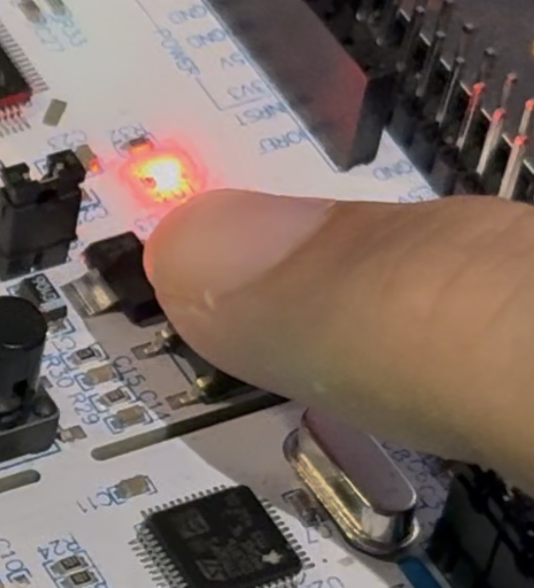 | Button is **pressed** (PC13 pulled LOW).       |
| **On-Board LED (PA5)** |          | When the button is pressed, LED turns **OFF**. |

---

# 🟢 Case 3 — Button Released (Default State)

| Component              | Proof Image                                             | Behaviour Explanation                          |
| ---------------------- | ------------------------------------------------------- | ---------------------------------------------- |
| **User Button (PC13)** |  | Button is **released** (PC13 HIGH).            |
| **On-Board LED (PA5)** |            | When the button is released, LED turns **ON**. |

---
